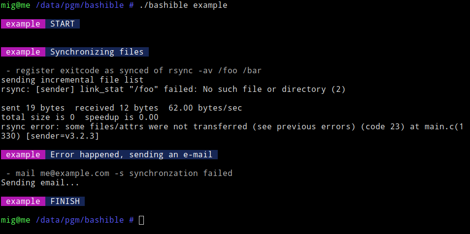
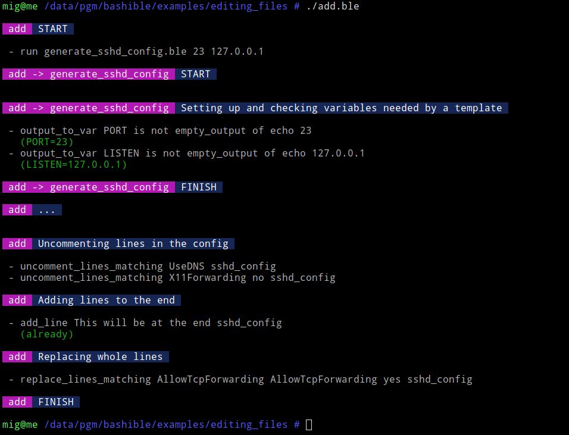

# BASHIBLE

Bashible is a deployment/automation tool written in Bash (DSL). Inspired by Ansible. Simplifies things and prevents usual mistakes.

Features:

  - improved readability
  - unhandled failures prevention
  - skipping already done tasks
  - command chaining
  - working directory always as expected
  - variable checking
  - dependencies; calling sub-scripts
  - delayed tasks executed on finish
  - child termination handler; no processes left running
  - modules: template engine, config editing, etc.
  - nice output

At the moment, bashible has been used on Arch linux. It may not be compatible with other platforms, because it internally uses GNU/sed, grep, etc.

Suggestions and bugfixes are welcome! :-)


## Example script

`@` represents a block of tasks, `-` represents a task. Both `@` and `-` are just bash functions with arguments.

The working directory is automatically set to the script's. All tasks will stop execution immediately on failure, unless prefixed by "ignore_errors".

```bash
#!/usr/local/bin/bashible

@ Synchronizing files
  - register exitcode as 'synced' of rsync -av /foo /bar

@ when synced
@ and test -f /etc/do-shutdown
@ Shutting down the machine after successful synchronization
  - shutdown -h now

@ when not synced
@ Error happened, sending an e-mail
  - mail me@me.com <<< "synchronzation failed"
```



Rewritten into pure Bash, the example above may look like this,

```bash
#!/bin/bash

cd `dirname $0`
set -eux -o pipefail

echo Synchronizing files
if rsync -av /foo /bar; then
  echo Shutting down the machine after successful synchronization
  if test -f /etc/do-shutdown; then
    shutdown -h now
  fi
else
  echo Error happened, sending an e-mail
  mail me@me.com <<< "synchronzation failed"
fi
```

## Another example output

(output of running examples/editing_files/add.ble)



## Another example

```bash
#!/usr/local/bin/bashible

@ Loading lists
  - output_to_var HOMES is not empty_output of ls -1 /home
  - output_to_var VHOSTS is not empty_output of ls -1 /etc/nginx/vhosts.d

@ Rsyncing data and saving error messages into a file
  - quiet output_to_file errlog.txt -2 rsync /foo /bar
```

## Another example

```bash
#!/usr/local/bin/bashible

use template

@ Doing some checks and setting variables
  - output_to_var HOST is not empty_output of echo $1
  - output_to_var PORT is not empty_output of echo $2
  - is not empty_var HOME
  - is empty_dir /home/$HOME

@ Copying default files
  - cp -av /mnt/defaults /home/$HOME

@ Creating .bashrc from a template
  # the template needs two variables to be set, HOST and PORT
  # these are set by arguments of this script ($1 and $2)
  - output_to_file /home/$HOME/.bashrc.tmp template /mnt/templates/bashrc.tpl
  - mv /home/$HOME/.bashrc.tmp /home/$HOME/.bashrc
```

See also examples in the example directory.


## Install & usage

Install bashible and it's modules (sourceable functions - here just one module, "edit"). Copy everything to the same directory.

```bash
wget https://raw.githubusercontent.com/mig1984/bashible/master/bashible
wget https://raw.githubusercontent.com/mig1984/bashible/master/bashible.edit.ble
chmod 755 bashible
chmod 755 bashible.edit.ble
mv bashible /usr/local/bin
mv bashible.edit.ble /usr/local/bin
```

Run the script

```bash
bashible my-script.ble ARG1 ARG2 ...
```

or put she-bang in the beginning of the script and then run it directly

```bash
#!/usr/local/bin/bashible
```

run it

```bash
./my-script.ble ARG1 ARG2 ...
```

## Functions

### core functions

[@ MESSAGE](docs/@.md)  
[- COMMAND ARGS ...](docs/-.md)  
[absolute_path PATH](docs/absolute_path.md)  
[bashible_version](docs/bashible_version.md)  
[base_dir PATH](docs/base_dir.md)  
[delayed COMMAND ARGS ...](docs/delayed.md)  
[evaluate STRING](docs/evaluate.md)  
[fail MESSAGE](docs/fail.md)  
[finish MESSAGE](docs/finish.md)  
[halt MESSAGE](docs/halt.md)  
[not COMMAND ARGS ...](docs/not.md)  
[ignore_errors COMMAND ARGS ...](docs/ignore_errors.md)  
[is_toplevel](docs/is_toplevel.md)  
[is_empty_dir PATH](docs/is_empty_dir.md)  
[is_empty_output COMMAND ARGS ...](docs/is_empty_output.md)  
[is_empty_var VAR](docs/is_empty_var.md)  
[output_to_file DEST OPTS COMMAND ARGS ...](docs/output_to_file.md)  
[output_to_var NAME OPTS COMMAND ARGS ...](docs/output_to_var.md)  
[orig_dir](docs/orig_dir.md)  
[print_error MSG](docs/print_error.md)  
[print_info MSG](docs/print_info.md)  
[print_warn MSG](docs/print_warn.md)  
[quiet COMMAND ARGS ...](docs/quiet.md)  
[reset_base_dir](docs/reset_base_dir.md)  
[result NAME COMMAND ARGS ...](docs/result.md)  
[run PATH ARGS ...](docs/run.md)  
[unless_already COMMAND ARGS ...](docs/unless_already.md)  
[use FEATURES ...](docs/use.md)  

### sugar

These do the same:  
  
when not is_empty_dir /home  
when is not empty_dir /home  
  
when not is_empty_var HOSTNAME  
when is not empty_var HOSTNAME  
  
when not is_empty_output ls /home  
when is not empty_output of ls /home  
  
result synced rsync /foo /bar  
register exitcode as 'synced' of rsync /foo /bar  

### file-editing functions - found in bashible.edit module

[add_line LINE PATH](docs/add_line.md)  
[append_line LINE PATH](docs/append_line.md)  
[comment_lines_matching REGEXP PATH](docs/comment_lines_matching.md)  
[prepend_line LINE PATH](docs/prepend_line.md)  
[remove_lines_matching REGEX PATH](docs/remove_lines_matching.md)  
[replace_lines_matching REGEXP STRING PATH](docs/replace_lines_matching.md)  
[replace_matching REGEXP STRING PATH](docs/replace_matching.md)  
[uncomment_lines_matching REGEXP PATH](docs/uncomment_lines_matching.md)  

### template engine - found in bashible.template module

[template TEMPLATE_PATH RESULT_PATH](docs/template.md)  

### timeout - found in bashible.timeout module

[in_timeout SECS COMMAND ARGS ...](docs/in_timeout.md)  

### network-oriented functions - found in bashible.net module

[wait_for_tcp MATCH up|down](docs/wait_for_tcp.md)  


## TODO

Write more docs and examples.

Modularize. The bashible core in the version 1.0 should contain only necessary functions and should not ever change. For instance, the [delayed](docs/delayed.md) and [unless_already COMMAND ARGS ...](docs/unless_already.md) functions now need two temporary files. These files are created on every bashible startup. These functions should go into optional modules instead.

Create tests. Bashible uses GNU/grep, GNU/sed and other programs which may not work properly on all platforms.

Make bashible multiplatform.

Create more modules and/or integrate existing Bash libraries.
